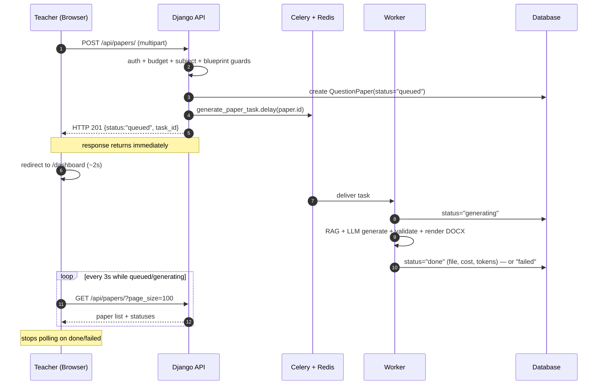
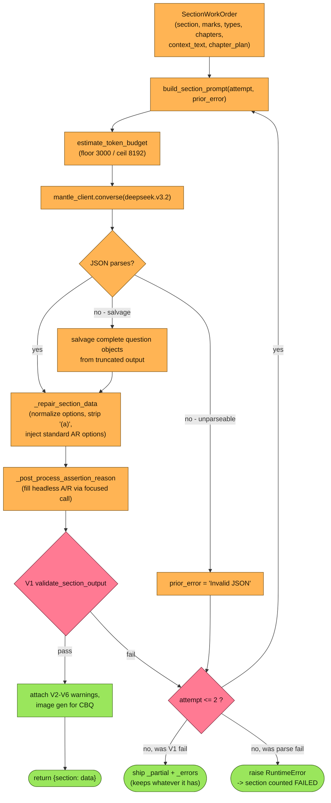
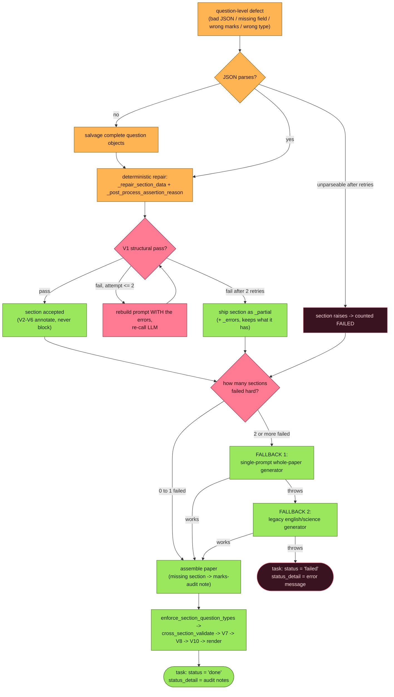

# Generate Paper — End-to-End Flow

What happens from the moment a teacher clicks **Generate Paper** to the rendered DOCX showing up on the dashboard.

> **How to view the diagrams:** these are [Mermaid](https://mermaid.js.org/) flowcharts.
> They render automatically on **GitHub**, in **VS Code** with the *Markdown Preview Mermaid Support* extension,
> in **Obsidian**, JetBrains IDEs, or any Mermaid live editor.

**Models & infra at a glance**

| Role | What | Where |
|------|------|-------|
| Generation LLM | `deepseek.v3.2` | Bedrock Mantle · `core/mantle_client.py` |
| Validation LLM | `qwen.qwen3-32b` | Bedrock Mantle · `core/mantle_client.py` |
| Embeddings | `nomic-embed-text` (768d, Ollama) / OpenRouter | `core/embeddings.py` |
| Vector store | ChromaDB `vector_store/{shared\|school_<id>}/<class>_<subject>/` | `core/embeddings.py` |
| Images | Together AI `flash-image-2.5` → Pollinations fallback | `core/generator.py` |
| Queue | Celery + Redis | `core/tasks.py` |

---

## 1. The big picture — request is async

The HTTP request **returns before the paper exists**. The browser then polls until the worker finishes.

---

## 2. Full pipeline (phases 00 → 09)

```mermaid
flowchart TD
    %% ---------- 00 Browser ----------
    subgraph FE["00 · Browser — frontend/src/app/generator/page.js"]
        A0["User clicks Generate Paper"]
        A1{"chapter selected<br/>OR one-mark test?"}
        A2["build FormData (multipart):<br/>class_name, subject, pattern,<br/>difficulty, chapters(csv), duration,<br/>total_marks, additional_docs[]"]
        A3["POST /api/papers/<br/>Authorization: Token + X-CSRFToken"]
    end
    A0 --> A1
    A1 -- no --> AX["error: 'select at least one chapter'"]
    A1 -- yes --> A2 --> A3

    %% ---------- 01 API ----------
    subgraph AP["01 · Django API — api/views.py QuestionPaperViewSet.create()"]
        B1{"_generation_blocked?<br/>budget / 1 active gen"}
        B2{"_allowed_subject?"}
        B3{"blueprint matches<br/>class + subject?"}
        B4["parse additional_docs<br/>PDF/DOCX to text -> extra_context"]
        B5["QuestionPaper.objects.create(status='queued')"]
        B6["generate_paper_task.delay(...)<br/>store task_id"]
    end
    A3 --> B1
    B1 -- blocked --> E429["HTTP 429 {error}"]
    B1 -- ok --> B2
    B2 -- denied --> E403["HTTP 403 {error}"]
    B2 -- ok --> B3
    B3 -- mismatch --> E400["HTTP 400 {error}"]
    B3 -- ok --> B4 --> B5 --> B6

    B6 --> R201["HTTP 201 {status:'queued', task_id}"]
    R201 -. returns to browser .-> POLL

    %% ---------- async ----------
    B6 ==> QUEUE{{"Celery queue (Redis)"}}

    %% ---------- 02 Worker ----------
    subgraph WK["02-03 · Celery Worker — core/tasks.py + core/generator.py"]
        C1["status='generating', record task_id"]
        C2["split '11-A' -> class 11 / section A<br/>resolve school_id"]
        C3{"one-mark test?"}
        C4["rebuild pattern: single MCQ section"]
        C5["generator.generate_paper(...)"]
        C6{"strategy"}
    end
    QUEUE --> C1 --> C2 --> C3
    C3 -- yes --> C4 --> C5
    C3 -- no --> C5
    C5 --> C6
    C6 -->|attempt 1| PAR["parallel per-section pipeline"]
    C6 -->|attempt 2 on error| SINGLE["single-prompt fallback"]
    C6 -->|last resort| LEGACY["legacy english/science"]

    %% ---------- 04 RAG ----------
    subgraph RG["04 · RAG — core/embeddings.py + section_generator.get_section_context_map"]
        D1["open ChromaDB:<br/>vector_store/{shared|school_id}/class_subject"]
        D2["embed query (Ollama nomic-embed-text 768d)"]
        D3["cosine search; chunks weighted<br/>by CBSE UNIT_MARKS_WEIGHTS"]
        D4["dedupe + cap per type<br/>(MCQ ~4k ... source ~10k chars)"]
    end
    PAR --> D1 --> D2 --> D3 --> D4

    %% ---------- 05 LLM gen ----------
    subgraph LM["05 · LLM generation — section_generator.py (ThreadPool max=3)"]
        F1["build_work_orders + plan_chapter_allocation"]
        F2["build_section_prompt:<br/>difficulty + type directive +<br/>chapter plan + JSON schema + AR rules"]
        F3["mantle_client.converse(deepseek.v3.2)"]
        F4["extract_section_json (+ salvage truncated)"]
        F5["_repair_section_data +<br/>_post_process_assertion_reason"]
    end
    D4 --> F1 --> F2 --> F3 --> F4 --> F5

    %% ---------- 06 Validation ----------
    F5 --> V1{"V1 structural gate<br/>validate_section_output"}
    V1 -- fail --> RETRY["retry (<=2x)<br/>feed errors back into prompt"]
    RETRY --> F2
    V1 -->|fail after retries| PARTIAL["ship _partial + _errors"]
    V1 -->|pass| V2["V2-V10 annotate (non-blocking):<br/>quality, grounding, MCQ verify,<br/>uniqueness, CBQ passage, competency,<br/>coherence, final audit"]
    V2 --> XS["cross_section_validate:<br/>renumber + strip foreign types"]
    PARTIAL --> XS

    %% ---------- 07 Render ----------
    subgraph RN["07 · Render — generator.render_docx"]
        G1["regroup by type, fix per-type marks"]
        G2["generate images (Together AI -> Pollinations)"]
        G3["write .docx to MEDIA_ROOT/question_papers/"]
    end
    XS --> G1 --> G2 --> G3
    SINGLE --> G1
    LEGACY --> G1

    %% ---------- 08 Persist ----------
    subgraph PS["08 · Persist — core/tasks.py tail"]
        H1["save file, cost, in/out tokens, paper_data"]
        H2["audits -> status_detail notes"]
        H3["atomic F() bump school counters"]
        H4(["status='done'"])
        HF(["status='failed'<br/>status_detail = error message"])
    end
    G3 --> H1 --> H2 --> H3 --> H4

    %% ---------- 09 Poll ----------
    subgraph PL["09 · Browser — dashboard/page.js"]
        POLL["poll GET /papers/?page_size=100 every 3s"]
        P1{"status?"}
        P2["show Completed -> open editor<br/>(docx_file + get_content)"]
        P3["show Failed"]
        P4["show Generating / Stalled (>15min)"]
    end
    H4 -. picked up by poll .-> POLL
    HF -. picked up by poll .-> POLL
    POLL --> P1
    P1 -->|done| P2
    P1 -->|failed| P3
    P1 -->|queued or generating| P4
    P4 --> POLL

    %% ---------- styles ----------
    classDef fe fill:#5BC8FF,stroke:#1b3a4a,color:#06141c;
    classDef api fill:#7C9CFF,stroke:#26336b,color:#0a1030;
    classDef wrk fill:#B98BFF,stroke:#42297a,color:#160a2e;
    classDef rag fill:#4FD1A8,stroke:#1d5a47,color:#062019;
    classDef llm fill:#FFB454,stroke:#7a5012,color:#241404;
    classDef val fill:#FF7A93,stroke:#7a263a,color:#2a070f;
    classDef out fill:#9AE65C,stroke:#3f6b1c,color:#10240a;
    classDef err fill:#3a1320,stroke:#FF7A93,color:#ffd9e0;

    class A0,A1,A2,A3,AX fe;
    class B1,B2,B3,B4,B5,B6,R201 api;
    class C1,C2,C3,C4,C5,C6,QUEUE,PAR,SINGLE,LEGACY wrk;
    class D1,D2,D3,D4 rag;
    class F1,F2,F3,F4,F5,RETRY llm;
    class V1,V2,XS,PARTIAL val;
    class G1,G2,G3,H1,H2,H3,H4 out;
    class POLL,P1,P2,P3,P4 fe;
    class E429,E403,E400,HF err;
```

---

## 3. Generation — every step and how it can fail

The worker runs `generate_paper` → `generate_universal_paper`, which prefers the **parallel per-section pipeline** and degrades gracefully. Each step below has its own failure handling; very little is fatal until the very end.

| # | Step (function) | What it does | If it fails |
|---|-----------------|--------------|-------------|
| G1 | `pattern_sections_to_blueprint_dict` | Normalize the pattern into a blueprint of sections + collect all question types. | If it yields nothing, falls back to `get_blueprint()` (legacy/seed blueprint). If *that* raises → `generate_paper` drops to the legacy generator. |
| G2 | `get_section_context_map` → `get_section_context` → `embeddings.query` | **RAG.** Per section: resolve sub-subject, scope chapters, embed query (Ollama 768d), cosine-search ChromaDB, weight chunks by CBSE unit marks, cap per type. | Per-query errors are caught and skipped. **Sub-subject store empty** → retry with parent subject. **Context quality check** (`_validate_context_quality`, qwen3-32b) says insufficient or `<500` chars → retry with a broader, chapter-less query. **Still empty / dim-mismatch** → section proceeds with *no* context and the prompt tells the model to use its own CBSE knowledge. Never fatal. |
| G3 | `build_work_orders` | One `SectionWorkOrder` per section. Coerces every numeric field (handles `"varies"`, string numbers), and **derives** missing `marks_per_question` / `questions_count` so a section never asks for 0 questions. | Defensive by design — bad/blank fields are repaired, not raised. |
| G4 | `plan_chapter_allocation` | Assigns each question slot a specific chapter, weighted by CBSE marks, coordinated paper-wide for max unique coverage. | No-op for chapter-less sections (e.g. One-Mark Test) — they keep the "spread across all topics" instruction. |
| G5 | `estimate_token_budget` | Sizes the LLM output budget per section (floor **3000**, ceil **8192**); mixed-marks sections summed per type so JSON isn't truncated. | If under-sized anyway and output truncates → caught by JSON salvage in G7. |
| G6 | `generate_paper_parallel` | `ThreadPoolExecutor(max_workers=3)` runs `generate_section` for every work order. | A section that **raises** is recorded in `failed[]`. **≥2 sections fail → `RuntimeError`** → whole pipeline falls back to single-prompt. **Exactly 1 fails** → logged, paper assembled without it (the marks/coverage audit in `tasks.py` notes the shortfall). |
| G7 | `generate_section` (per thread) | Build prompt → `converse(deepseek.v3.2)` → parse → repair → **V1** → annotate (V2–V6) → return. Pure-LA / source-CBQ sections go one-question-at-a-time via `generate_la_cbq_individually`. | See the retry loop + escalation ladder below. The individual-question path, if it throws, **falls back to batch generation** for that section. |
| G8 | `mantle_client.converse` | POST to Bedrock Mantle `chat/completions`; round-robins 2 API keys. | Retries **429/503** with exponential backoff (default 3 attempts). On final failure → raises → bubbles up to G6 as a failed section. |

### The per-section retry loop

Each section is generated independently with up to **2 retries** (3 attempts total, `MAX_SECTION_RETRIES = 2`) that feed the exact V1 errors back into the next prompt.

---

## 4. Failure escalation ladder

The single most important property of this pipeline: **a failure almost never aborts the paper — it degrades to a cheaper strategy.** Only an exception that escapes *all* fallbacks marks the paper `failed`.

> **Note — the two fallback paths validate more loosely.** The single-prompt and legacy generators run *at most* the V1 structural check; they do **not** run the V2–V10 quality/answer/grounding chain. So a paper produced by a fallback is structurally sound but un-audited — that's the trade-off for surviving a parallel-pipeline failure.

---

## 5. The ten validation gates — in full

Order of execution: **V1** runs *inside* each section's retry loop (the only blocker). **V2–V6** run once per section right after V1 passes (warn + store). After all sections assemble, the paper-level steps run once: **enforce_section_question_types → cross_section_validate → V7 → V8 → V10**.

```mermaid
flowchart LR
    Q["section JSON"] --> V1

    subgraph BLOCK["BLOCKING (per section, in retry loop)"]
        V1["V1 · structural<br/>validate_section_output / _validate_by_subtype"]
    end

    subgraph PERSEC["PER SECTION · warn + store (never block)"]
        direction TB
        V2["V2 · quality critic (qwen3-32b)"]
        V3["V3 · NCERT grounding (qwen3-32b)"]
        V4["V4 · MCQ answer check (qwen3-32b, auto-corrects)"]
        V5["V5 · uniqueness (code + qwen3-32b, regenerates)"]
        V6["V6 · CBQ passage (qwen3-32b)"]
    end

    subgraph PAPER["PER PAPER · warn / auto-fix (never block)"]
        direction TB
        XS["cross_section_validate<br/>(renumber + cross-dedup)"]
        ET["enforce_section_question_types<br/>(drop foreign types)"]
        V7["V7 · competency 50/20/30 (qwen3-32b, re-tags)"]
        V8["V8 · coherence audit (qwen3-32b)"]
        V10["V10 · final paper audit (deepseek.v3.2)"]
    end

    V1 -->|pass| V2 --> V3 --> V4 --> V5 --> V6 --> ET --> XS --> V7 --> V8 --> V10 --> R(["render DOCX"])
    V1 -->|fail| RT["retry x2 -> ship _partial"]

    classDef val fill:#FF7A93,stroke:#7a263a,color:#2a070f;
    classDef out fill:#9AE65C,stroke:#3f6b1c,color:#10240a;
    class V1,V2,V3,V4,V5,V6,V7,V8,V10,XS,ET,RT val;
    class R,Q out;
```

### V1 · Structural validation — **THE ONLY BLOCKING GATE**
- **Where:** `validate_section_output` → `_validate_by_subtype`. Pure Python, no LLM.
- **Checks (all questions):** exact question **count**; non-empty `text`; **marks** match (uniform: each `== marks_per_question ±0.1`; mixed: each question's marks match its type's blueprint marks); valid `competency_type`; **per type/subtype:**
  - *MCQ* — exactly **4 non-empty** options keyed `a/b/c/d` + a valid `answer` (a/b/c/d).
  - *Assertion-Reason* — `text` contains full `Assertion (A): …` **and** `Reason (R): …` (>50 chars) + the 4 standard AR options.
  - *SA / VSA* — non-empty `answer_explanation`; *map_based* needs `map_note` + text ≥20 chars.
  - *LA* — `answer_explanation` **and** an `or_alternative` (CBSE internal choice).
  - *CBQ* — `sub_questions` present, each with `text`; **sub-question marks sum == question marks (±0.1)**; source-based needs `source_text` ≥80 chars.
  - **Answer-key bias** — any single option letter used in **>65%** of MCQs → rejected.
  - **Type distribution** — right count of each type (mixed) or no foreign types (uniform).
  - **Section marks total** — sum `== section marks (±1.0)`.
- **On fail:** all error strings are concatenated and injected into the next prompt under `⚠️ PREVIOUS ATTEMPT FAILED — FIX THESE ISSUES`, then the LLM is re-called. **Up to 2 retries.** After that the section ships with `_partial=True` + `_errors=[…]` (it keeps whatever questions it has — *nothing is discarded*).

### V2 · Content quality critic — non-blocking
- **Where:** `run_content_quality_critic`. **Model: qwen3-32b**, temp 0.1, one batched call per section.
- **Checks:** scores every question 1–5 on **clarity, NCERT alignment, difficulty match, pedagogical value**; average `<3` is flagged.
- **On fail (low scores):** flagged questions stored in `_quality_flags` (`{qnum, avg_score, scores, issues}`). **No regeneration, no block.** Feeds V5's "which one is weaker" decision and the V10 audit.
- **If the LLM call itself errors:** caught → returns `[]` → silently skipped.

### V3 · NCERT grounding — non-blocking
- **Where:** `check_ncert_grounding`. **Model: qwen3-32b**, temp 0.1. Only **SA/LA** questions, against the already-retrieved context (no new embedding calls).
- **Checks:** is each question answerable from / present in the NCERT context chunks?
- **On fail (ungrounded):** stored in `_grounding_issues` (`{qnum, text_snippet, issue}`). **No block, no regen.**
- **If the LLM call errors:** caught → `[]`.

### V4 · MCQ answer-key verification — non-blocking, **auto-corrects**
- **Where:** `verify_mcq_answers` → `_blind_answer_mcqs`. **Model: qwen3-32b**, temp 0.1, **blind** (no context given — it must answer from its own knowledge), batched 10/call.
- **Logic:** Pass 1 blind-answers every MCQ/AR. For **high-confidence disagreements** with the stored key, Pass 2 re-answers them. If **both passes agree** on the *same different* option with **high confidence** → the stored `answer` is **overwritten** (`corrected`). Lesser disagreements are flagged `suspect` but left unchanged — one model opinion can never flip a correct key.
- **On fail:** `_mcq_answer_corrections` (keys fixed in place) + `_mcq_answer_warnings` (suspect, unchanged). **No block.**
- **If the LLM call errors:** caught → `[]`.

### V5 · Uniqueness (two layers) — non-blocking, **can regenerate**
- **Where:** `validate_uniqueness` (L1) + `verify_and_fix_semantic_duplicates` (L2).
- **L1 (code only):** token-overlap (`_concept_overlap`) **>0.50** between any two questions in the section → flagged pair.
- **L2 (only if L1 flagged):** **qwen3-32b** confirms "same concept?" per pair. If confirmed → the **lower-quality** question (by V2 score, else the second) is **regenerated** with **deepseek.v3.2**, told to avoid the kept concept, and swapped in place.
- **On fail:** unresolved pairs → `_uniqueness_warnings`; L1 false positives are dropped after the LLM says "not duplicates". **No block.**
- **If a pair's LLM call errors:** that pair is skipped (left as-is).

### V6 · CBQ / source passage — non-blocking
- **Where:** `validate_cbq_passage`. **Model: qwen3-32b**, temp 0.1. Only for sections with a real `passage` ≥50 chars (image-based CBQ is skipped).
- **Checks:** passage is factually accurate & NCERT-aligned; every sub-question is answerable **solely from the passage** (no outside knowledge).
- **On fail:** issues stored in `_cbq_passage_issues`. **No block, no rewrite.**
- **If the LLM call errors:** caught → `[]`.

### cross_section_validate — structural, **cannot fail**
- **Where:** `cross_section_validate`. Pure Python.
- **Does:** renumbers every question **sequentially** across all sections (`qnum`); then cross-section dedup — token overlap **>0.55** between *different* sections → recorded in `_cross_section_duplicates` (**flagged only, not removed**).

### enforce_section_question_types — structural safety net
- **Where:** `enforce_section_question_types`. Pure Python, runs before `cross_section_validate`.
- **Does:** removes any question whose **coarse** type (MCQ/SA/VSA/LA/CBQ/MAP) isn't allowed in its section (AR counts as MCQ, map as SA; un-classifiable "other" is **kept**). Drops are logged in `_dropped_wrong_type` and surface as a shortfall in the marks audit.
- **On "fail" (foreign types found):** they're dropped — the section ships smaller rather than wrong.

### V7 · Competency distribution (CBSE 50/20/30) — non-blocking, **auto-fixes tags**
- **Where:** `validate_competency_distribution` (audit) + `enforce_competency_distribution` (fix). **Model: qwen3-32b** (fix step only).
- **Checks (by marks):** application **≥45%**, recall **≤25%**, constructed **≥25%**, untagged **≤10%**.
- **On fail (non-compliant):** the LLM is asked to **re-tag** mislabeled questions (e.g. recall→application where valid; never downgrades `constructed`); corrections applied in place, then re-audited. Result stored as `_competency_report`. **Tags change, questions don't; never blocks.**
- **If the LLM call errors:** enforcement skipped, original tags kept.

### V8 · Cross-section coherence audit — non-blocking
- **Where:** `run_cross_section_coherence_audit`. **Model: qwen3-32b**, temp 0.1, one call per paper.
- **Checks:** no chapter over-represented (>50%); all requested chapters covered; section progression sane (MCQ early, SA/LA late); structural problems.
- **On fail:** `_coherence_report` = `{coherent, issues, chapter_balance, missing_chapters, recommendation}`. **No block.**
- **If the LLM call errors:** caught → returns `{coherent: true, issues: []}` (assumes fine).

### V10 · Final paper audit — non-blocking **master gate**
- **Where:** `run_final_paper_audit`. **Model: deepseek.v3.2** (the strong model), temp 0.1, one call per paper.
- **Does:** aggregates **all** accumulated warnings (V2/V3/V4/V5/V6 + cross-dups) into one summary and asks for a holistic verdict: `quality_score` 1–10, `ready_to_issue` (yes / no / needs-minor-fix), top-3 issues, one-line verdict.
- **On fail / low score:** stored as `_final_audit`. It is a **report, not a gate** — the paper renders and is saved regardless. The verdict surfaces to the teacher via `status_detail`.
- **If the LLM call errors:** caught → `{quality_score: null, ready_to_issue: "unknown", verdict: "Audit unavailable"}`.

### Quick reference

| Gate | Model | Scope | Blocks? | On failure |
|------|-------|-------|---------|------------|
| **V1** structural | — (Python) | section | **YES** | retry ×2 → ship `_partial` + `_errors` |
| V2 quality critic | qwen3-32b | section | no | store `_quality_flags` |
| V3 NCERT grounding | qwen3-32b | section (SA/LA) | no | store `_grounding_issues` |
| V4 MCQ answer | qwen3-32b | section (MCQ/AR) | no | **auto-correct** on 2× high-conf, else flag suspect |
| V5 uniqueness | Python + qwen3-32b | section | no | **regenerate** weaker dup, else warn |
| V6 CBQ passage | qwen3-32b | section (passage) | no | store `_cbq_passage_issues` |
| enforce types | — (Python) | paper | no | **drop** foreign-type questions |
| cross_section | — (Python) | paper | no | renumber + flag cross-dups |
| V7 competency | qwen3-32b | paper | no | **re-tag** questions, re-audit |
| V8 coherence | qwen3-32b | paper | no | store `_coherence_report` |
| V10 final audit | deepseek.v3.2 | paper | no | store `_final_audit` verdict |

> All `_…` flags are stuffed onto each section's data, dumped to `temp_questions.json` for inspection, and summarized into the paper's `status_detail` — so even though only V1 blocks, every other finding is visible to the teacher after generation.

---

### Key source files

| File | Role |
|------|------|
| `frontend/src/app/generator/page.js` | the form + `handleSubmit()` |
| `frontend/src/lib/api.js` | Axios client, auth/CSRF interceptors |
| `frontend/src/app/dashboard/page.js` | 3-second status polling |
| `api/views.py` | `QuestionPaperViewSet.create()` + guards, status/retry/regenerate actions |
| `api/serializers.py` | `QuestionPaperSerializer` |
| `core/tasks.py` | `generate_paper_task` (Celery orchestration) |
| `core/generator.py` | strategy selection, `render_docx` |
| `core/section_generator.py` | parallel generation, prompts, V1–V10 validation |
| `core/embeddings.py` | ChromaDB + embeddings (RAG) |
| `core/mantle_client.py` | Bedrock Mantle LLM client |
